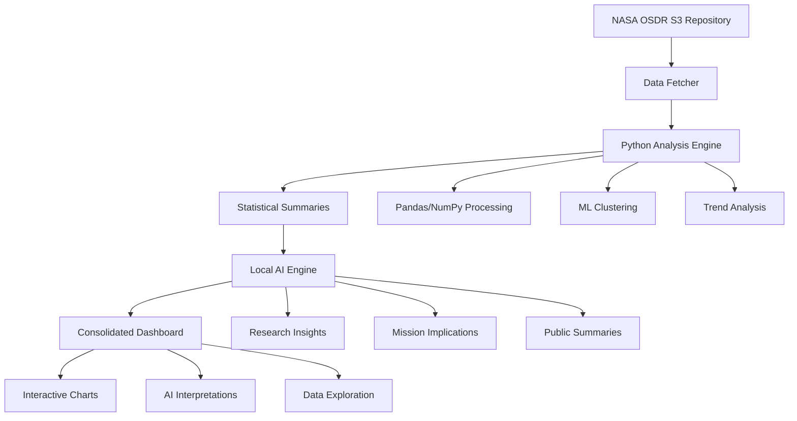

# NASA OSDR Complete Data Analysis Pipeline

🚀 **Complete implementation of the workflow**: Get Data → Preprocess → Summarize → Analyze with Local AI → Dashboard

This pipeline fetches real NASA OSDR data, performs comprehensive analysis, generates AI insights using local models, and provides data for the consolidated dashboard.

## 🎯 Workflow Overview



## 🔧 Installation & Setup

### 1. Install Dependencies
```bash
cd data-pipeline
pip install -r requirements.txt
python -m spacy download en_core_web_sm
```

### 2. Set Environment Variables
```bash
# No external API keys required - all models run locally
# Optional for enhanced features
export AWS_ACCESS_KEY_ID="your-aws-key"
export AWS_SECRET_ACCESS_KEY="your-aws-secret"
```

### 3. Create Data Directory
```bash
mkdir data
```

## 🚀 Quick Start

### Option 1: Run Complete Pipeline
```bash
# Full pipeline with real NASA data
python pipeline_orchestrator.py --mode full
```

### Option 2: Step-by-Step Execution
```bash
# Step 1: Get Data
python pipeline_orchestrator.py --mode analyze

# Step 2: Generate AI Insights  
python pipeline_orchestrator.py --mode local-ai

# Step 3: Start API Server (for consolidated dashboard)
python pipeline_orchestrator.py --mode api
```

### Option 3: Direct API Launch
```bash
uvicorn main:app --host localhost --port 8003
```

## 📊 Pipeline Components

### 1. 🔍 Data Fetcher (`osdr_processor.py`)
- **Purpose**: Pull NASA OSDR dataset from AWS S3 repository
- **Features**:
  - Fetches real NASA publications
  - Handles heterogeneous file formats (tar, zip, PDF)
  - Processes metadata and full-text content
  - Async processing for efficiency

### 2. 🔬 Data Analyzer (`data_analyzer.py`)
- **Purpose**: Use Python (pandas/numpy) to clean, normalize, and analyze
- **Analysis Types**:
  - **Temporal Trends**: Publication growth, seasonal patterns
  - **Research Areas**: Distribution, diversity metrics
  - **Organism Analysis**: Model organism usage, diversity
  - **Collaboration Patterns**: Author networks, team sizes
  - **ML Clustering**: Unsupervised grouping of publications
  - **Statistical Summaries**: Key metrics and insights

### 3. 📝 Text Summarizer (Built into Analyzer)
- **Purpose**: Turn numerical findings into short text summaries
- **Output**: Human-readable summaries optimized for local AI processing

### 4. 🤖 Local AI Engine (`transformer_analyzer.py`)
- **Purpose**: Process summaries with local transformer models for natural-language explanations
- **Insight Types**:
  - **Scientific Explanations**: What findings mean for space biology
  - **Research Gaps**: Underexplored areas and opportunities
  - **Mission Implications**: Impact on space exploration
  - **Trend Analysis**: Strategic insights for research planning
  - **Public Summaries**: Accessible explanations for general audience
  - **Q&A Responses**: Answers to common research questions

### 5. 📈 Data API (`main.py`)
- **Purpose**: FastAPI backend providing data for the consolidated dashboard
- **Features**:
  - **Real-time Data Processing**: API endpoints for analysis results
  - **Data Endpoints**: RESTful APIs for all analysis data
  - **AI Insights API**: Endpoints for local AI insights
  - **Search Functionality**: Publication search and filtering
  - **Export Capabilities**: Data export in multiple formats

## 🔗 API Integration

The pipeline provides a FastAPI backend (`main.py`) for integration with the consolidated dashboard:

```python
# Example API usage
import requests

# Process data
response = requests.post("http://localhost:8003/process")

# Search publications
search_data = {
    "query": "microgravity effects",
    "research_areas": ["Human Physiology"],
    "limit": 50
}
response = requests.post("http://localhost:8003/search", json=search_data)

# Get statistics
response = requests.get("http://localhost:8003/statistics")
```

## 📋 Usage Examples

### Example 1: Full Pipeline with Real Data
```bash
# Run complete pipeline
python pipeline_orchestrator.py --mode full

# API server will be available at http://localhost:8003
# Access consolidated dashboard at http://localhost:3000
```

### Example 2: Analysis Only (No AI)
```bash
# Run analysis without AI processing
python pipeline_orchestrator.py --mode analyze

# Then start API server for dashboard access
uvicorn main:app --host localhost --port 8003
```

## 📁 Output Files

The pipeline generates several data files:

```
data/
├── processed_publications.json    # Raw NASA OSDR data
├── analysis_results.json         # Statistical analysis results
└── local_ai_insights.json        # AI-generated insights
```

### Sample Output Structure:

**`analysis_results.json`**:
```json
{
  "temporal_trends": {
    "yearly_publications": {"2020": 45, "2021": 52, "2022": 61},
    "average_growth_rate": 0.125,
    "most_productive_year": 2022
  },
  "research_areas": {
    "area_distribution": {"Human Physiology": 89, "Plant Biology": 67},
    "shannon_diversity": 2.45
  },
  "text_summaries": [
    "NASA OSDR dataset contains 234 publications spanning 2015-2023...",
    "Research Area Diversity: 2.45. Research is highly diverse..."
  ]
}
```

**`local_ai_insights.json`**:
```json
{
  "insights": {
    "explanations": [
      "These findings reveal significant growth in NASA space biology research..."
    ],
    "research_gaps": [
      "Analysis identifies key opportunities in deep space radiation biology..."
    ],
    "mission_implications": [
      "For Mars missions, these findings suggest critical considerations..."
    ]
  }
}
```

## 🎛️ Dashboard Integration

### Consolidated Dashboard Access:
The data pipeline now feeds into a consolidated dashboard built with Next.js, accessible at:
- **Dashboard URL**: http://localhost:3000
- **API Endpoint**: http://localhost:8003

### Dashboard Features:
1. **📊 Key Metrics**: Total publications, research areas, organisms, timeline
2. **📈 Advanced Visualizations**: 
   - Interactive heatmaps and correlation analysis
   - Volcano plots for differential analysis
   - Time series analysis with trend detection
   - Principal component analysis (PCA)
   - Network analysis for collaboration mapping
   - 3D research landscapes
   - Real-time data streaming
3. **🤖 AI Insights**: Organized presentation of local AI insights
4. **📋 Data Explorer**: Interactive table of raw publications
5. **🔍 Search & Filter**: Advanced search capabilities

## 🔧 Configuration Options

### Environment Variables:
```bash
# Optional
AWS_ACCESS_KEY_ID=your-aws-key
AWS_SECRET_ACCESS_KEY=your-aws-secret
DATABASE_URL=postgresql://...
REDIS_URL=redis://...
```

### Command Line Options:
```bash
python pipeline_orchestrator.py \
    --mode full \
    --verbose               # Enable debug logging
```

## 🚀 Deployment

### Local Development:
```bash
# Install and run
pip install -r requirements.txt
python pipeline_orchestrator.py --mode full
```

### Production Deployment:
See `../deployment/aws/README.md` for AWS deployment options:
- **Elastic Beanstalk** (easiest)
- **ECS with Docker** (production)
- **EC2 instances** (manual control)

## 🔍 Troubleshooting

### Common Issues:

1. **Missing Dependencies**:
   ```bash
   pip install -r requirements.txt
   python -m spacy download en_core_web_sm
   ```

2. **Data Directory Issues**:
   ```bash
   mkdir data
   chmod 755 data
   ```

3. **Port Conflicts**:
   - API Server: http://localhost:8003
   - Frontend Dashboard: http://localhost:3000

### Debug Mode:
```bash
python pipeline_orchestrator.py --mode full --verbose
```

## 📈 Performance Notes

- **Real Data**: ~10-15 minutes for complete pipeline
- **Analysis Only**: ~1-2 minutes
- **API Server**: Launches in ~10 seconds

## 🤝 Contributing

1. Add new analysis components to `data_analyzer.py`
2. Enhance local AI processing in `transformer_analyzer.py`
3. Add API endpoints in `main.py`
4. Update pipeline orchestration in `pipeline_orchestrator.py`

## 📄 License

MIT License - See main project README for details.

---

🚀 **Ready to explore NASA space biology data with AI-powered insights through our consolidated dashboard!**