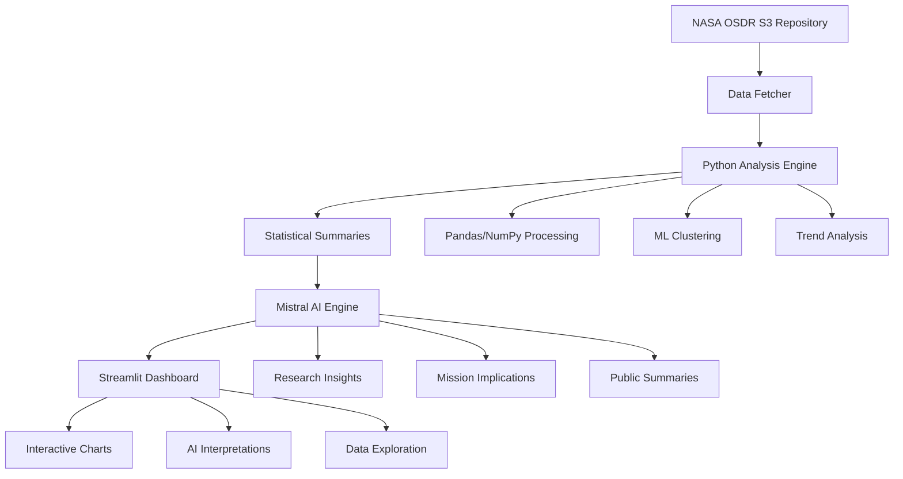

# NASA OSDR Complete Data Analysis Pipeline

🚀 **Complete implementation of the workflow**: Get Data → Preprocess → Summarize → Use Mistral → Dashboard

This pipeline fetches real NASA OSDR data, performs comprehensive analysis, generates AI insights, and displays everything in an interactive dashboard.

## 🎯 Workflow Overview



## 🔧 Installation & Setup

### 1. Install Dependencies
```bash
cd data-pipeline
pip install -r requirements.txt
python -m spacy download en_core_web_sm
```

### 2. Set Environment Variables
```bash
# Required for AI insights
export MISTRAL_API_KEY="your-mistral-api-key"

# Optional for enhanced features
export AWS_ACCESS_KEY_ID="your-aws-key"
export AWS_SECRET_ACCESS_KEY="your-aws-secret"
```

### 3. Create Data Directory
```bash
mkdir data
```

## 🚀 Quick Start

### Option 1: Run Complete Pipeline
```bash
# Full pipeline with real NASA data
python pipeline_orchestrator.py --mode full --api-key YOUR_MISTRAL_KEY
```

### Option 2: Step-by-Step Execution
```bash
# Step 1: Get Data
python pipeline_orchestrator.py --mode analyze

# Step 2: Generate AI Insights  
python pipeline_orchestrator.py --mode mistral --api-key YOUR_MISTRAL_KEY

# Step 3: Launch Dashboard
python pipeline_orchestrator.py --mode dashboard
```

### Option 3: Direct Dashboard Launch
```bash
streamlit run dashboard.py
```

## 📊 Pipeline Components

### 1. 🔍 Data Fetcher (`osdr_processor.py`)
- **Purpose**: Pull NASA OSDR dataset from AWS S3 repository
- **Features**:
  - Fetches real NASA publications
  - Handles heterogeneous file formats (tar, zip, PDF)
  - Processes metadata and full-text content
  - Async processing for efficiency

### 2. 🔬 Data Analyzer (`data_analyzer.py`)
- **Purpose**: Use Python (pandas/numpy) to clean, normalize, and analyze
- **Analysis Types**:
  - **Temporal Trends**: Publication growth, seasonal patterns
  - **Research Areas**: Distribution, diversity metrics
  - **Organism Analysis**: Model organism usage, diversity
  - **Collaboration Patterns**: Author networks, team sizes
  - **ML Clustering**: Unsupervised grouping of publications
  - **Statistical Summaries**: Key metrics and insights

### 3. 📝 Text Summarizer (Built into Analyzer)
- **Purpose**: Turn numerical findings into short text summaries
- **Output**: Human-readable summaries optimized for Mistral AI processing

### 4. 🤖 Mistral AI Engine (`mistral_engine.py`)
- **Purpose**: Feed summaries into Mistral for natural-language explanations
- **Insight Types**:
  - **Scientific Explanations**: What findings mean for space biology
  - **Research Gaps**: Underexplored areas and opportunities
  - **Mission Implications**: Impact on space exploration
  - **Trend Analysis**: Strategic insights for research planning
  - **Public Summaries**: Accessible explanations for general audience
  - **Q&A Responses**: Answers to common research questions

### 5. 📈 Interactive Dashboard (`dashboard.py`)
- **Purpose**: Streamlit app showing charts + Mistral's interpretations
- **Features**:
  - **Real-time Data Processing**: Run analysis from the dashboard
  - **Interactive Visualizations**: Plotly charts for exploration
  - **AI Insights Display**: Organized presentation of Mistral insights
  - **Data Exploration**: Browse raw publications
  - **Export Capabilities**: Download results and insights

## 🔗 API Integration

The pipeline also provides a FastAPI backend (`main.py`) for integration:

```python
# Example API usage
import requests

# Process data
response = requests.post("http://localhost:8001/process")

# Search publications
search_data = {
    "query": "microgravity effects",
    "research_areas": ["Human Physiology"],
    "limit": 50
}
response = requests.post("http://localhost:8001/search", json=search_data)

# Get statistics
response = requests.get("http://localhost:8001/statistics")
```

## 📋 Usage Examples

### Example 1: Full Pipeline with Real Data
```bash
# Set your Mistral API key
export MISTRAL_API_KEY="your-key-here"

# Run complete pipeline
python pipeline_orchestrator.py --mode full

# Dashboard will launch at http://localhost:8501
```

### Example 2: Analysis Only (No AI)
```bash
# Run analysis without Mistral AI
python pipeline_orchestrator.py --mode analyze

# Then launch dashboard to view results
streamlit run dashboard.py
```

## 📁 Output Files

The pipeline generates several data files:

```
data/
├── processed_publications.json    # Raw NASA OSDR data
├── analysis_results.json         # Statistical analysis results
└── mistral_insights.json         # AI-generated insights
```

### Sample Output Structure:

**`analysis_results.json`**:
```json
{
  "temporal_trends": {
    "yearly_publications": {"2020": 45, "2021": 52, "2022": 61},
    "average_growth_rate": 0.125,
    "most_productive_year": 2022
  },
  "research_areas": {
    "area_distribution": {"Human Physiology": 89, "Plant Biology": 67},
    "shannon_diversity": 2.45
  },
  "text_summaries": [
    "NASA OSDR dataset contains 234 publications spanning 2015-2023...",
    "Research Area Diversity: 2.45. Research is highly diverse..."
  ]
}
```

**`mistral_insights.json`**:
```json
{
  "insights": {
    "explanations": [
      "These findings reveal significant growth in NASA space biology research..."
    ],
    "research_gaps": [
      "Analysis identifies key opportunities in deep space radiation biology..."
    ],
    "mission_implications": [
      "For Mars missions, these findings suggest critical considerations..."
    ]
  }
}
```

## 🎛️ Dashboard Features

### Main Dashboard Sections:

1. **📊 Key Metrics**: Total publications, research areas, organisms, timeline
2. **📈 Visualizations**: 
   - Publication trends over time
   - Research area distribution
   - Organism usage patterns
   - Collaboration networks
3. **🤖 AI Insights**: Organized tabs for different insight types
4. **📋 Data Explorer**: Interactive table of raw publications
5. **🔧 Control Panel**: Run analysis and generate insights

### Interactive Controls:
- **Run Data Analysis**: Fetch and analyze NASA OSDR data
- **Generate AI Insights**: Process with Mistral AI
- **Filter & Search**: Explore specific research areas or time periods
- **Export Results**: Download data and insights

## 🔧 Configuration Options

### Environment Variables:
```bash
# Required
MISTRAL_API_KEY=your-mistral-api-key

# Optional
AWS_ACCESS_KEY_ID=your-aws-key
AWS_SECRET_ACCESS_KEY=your-aws-secret
DATABASE_URL=postgresql://...
REDIS_URL=redis://...
```

### Command Line Options:
```bash
python pipeline_orchestrator.py \
    --mode full \
    --api-key YOUR_KEY \
    --verbose               # Enable debug logging
```

## 🚀 Deployment

### Local Development:
```bash
# Install and run
pip install -r requirements.txt
python pipeline_orchestrator.py --mode full
```

### Production Deployment:
See `../deployment/aws/README.md` for AWS deployment options:
- **Elastic Beanstalk** (easiest)
- **ECS with Docker** (production)
- **EC2 instances** (manual control)

## 🔍 Troubleshooting

### Common Issues:

1. **Missing API Key**:
   ```bash
   export MISTRAL_API_KEY="your-key"
   # or
   python pipeline_orchestrator.py --api-key YOUR_KEY
   ```

2. **Missing Dependencies**:
   ```bash
   pip install -r requirements.txt
   python -m spacy download en_core_web_sm
   ```

3. **Data Directory Issues**:
   ```bash
   mkdir data
   chmod 755 data
   ```

4. **Port Conflicts**:
   - Dashboard: http://localhost:8501
   - API: http://localhost:8001
   - Frontend: http://localhost:3000

### Debug Mode:
```bash
python pipeline_orchestrator.py --mode full --verbose
```

## 📈 Performance Notes

- **Real Data**: ~10-15 minutes for complete pipeline
- **Analysis Only**: ~1-2 minutes
- **Dashboard**: Launches in ~30 seconds

## 🤝 Contributing

1. Add new analysis components to `data_analyzer.py`
2. Enhance Mistral prompts in `mistral_engine.py`
3. Add dashboard features in `dashboard.py`
4. Update pipeline orchestration in `pipeline_orchestrator.py`

## 📄 License

MIT License - See main project README for details.

---

🚀 **Ready to explore NASA space biology data with AI-powered insights!**